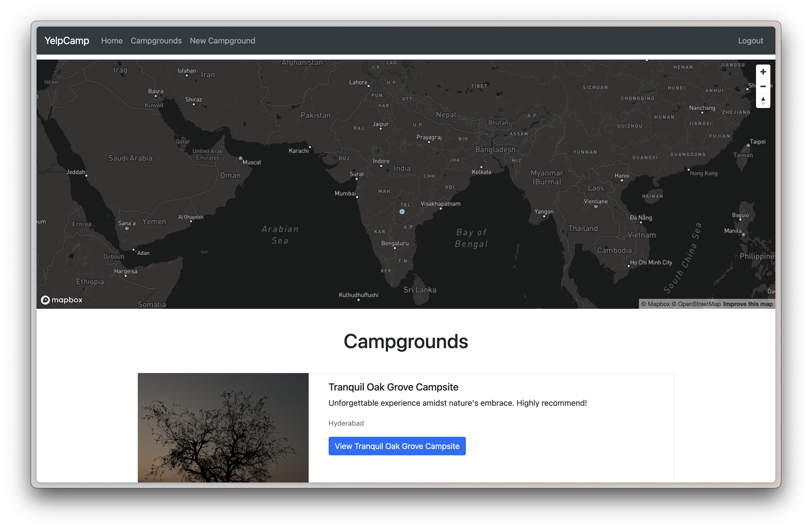
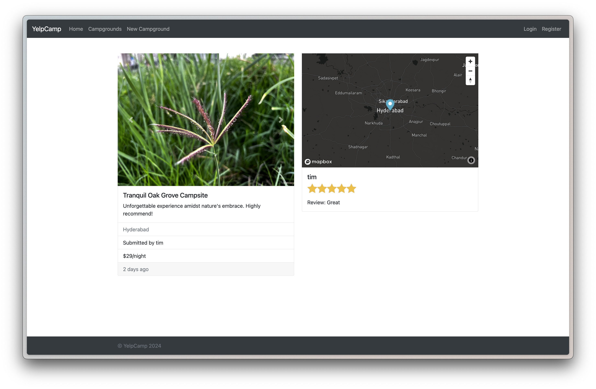

# YelpCamp

YelpCamp is a web application designed for campground exploration and creation. It offers user authentication, authorization, and CRUD (Create, Read, Update, Delete) functionalities. This project was developed as part of a web development course on Udemy, demonstrating expertise with relevant frameworks and technologies.

## Technologies Used

- **Node.js:** A JavaScript runtime environment for building server-side applications.
- **Express.js:** A web application framework for Node.js, used for creating robust APIs and web applications.
- **MongoDB:** A NoSQL database used for storing campground and user data.
- **Mapbox:** An open-source mapping platform for integrating interactive maps into the application.
- **Cloudinary:** A cloud-based image and video management service used for storing and serving images.

## Features

- **User Authentication:** Users can sign up, log in, and log out securely.
- **Authorization:** Different levels of access are implemented, such as admin and regular user roles.
- **CRUD Functionality:** Users can create, read, update, and delete campgrounds and comments.
- **Campground Exploration:** Interactive maps allow users to explore campgrounds and view their locations.
- **Responsive Design:** The application is designed to be accessible and usable across various devices and screen sizes.

## Screenshots


_Homepage of Yelp Camp._


_Map box plots of the submitted campgrounds and followed by the list of campground available._


_Details of Campground with location,pricing,images and reviews._

## Deployment

YelpCamp is hosted on Render and connected with MongoDB Atlas for database storage. [View Here](https://yelpcamp-india-vric.onrender.com/)

<!-- ## To run the project locally, follow these steps:

1. **Clone the repository:**

   ```bash
   git clone https://github.com/your-username/yelpcamp.git
   ```

2. **Install dependencies**

   ```bash
   cd yelpcamp
   npm install
   ```

3. **Set up environment variables**

   _Create a .env file in the root directory and add the following variables:_

   ```
   PORT=3000
   MONGODB_URI=your-mongodb-uri
   MAPBOX_TOKEN=your-mapbox-token
   CLOUDINARY_CLOUD_NAME=your-cloudinary-cloud-name
   CLOUDINARY_API_KEY=your-cloudinary-api-key
   CLOUDINARY_API_SECRET=your-cloudinary-api-secret
   ```

4. **MongoDB**
   Open a new terminal and type `brew services start mongodb-community` to start your local mongodb for the project to work on your local database.
   ```bash
   brew services start mongodb-community
   ``` -->

<!-- ## Acknowledgements

_This project was developed as part of a web development course on Udemy._
_Special thanks to the Colt Steel for the guidance._ -->
